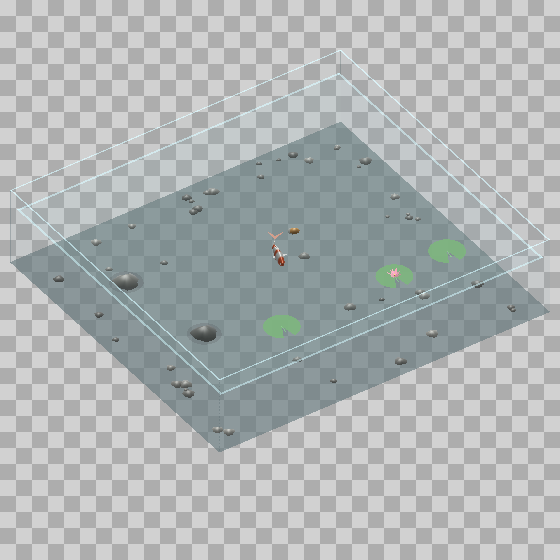

# Habitats and realistic interaction

Updated 2026-09-07. Active implementation: Windows/Rust.

## Design rule

People offer stimuli and arrange an environment; animals choose responses.
Escape and rest can override food. No universal petting, affection score,
offline starvation, or forced approach. Measured connectivity validates the
connectivity, not every behavior of the rendered animal.

## Controls

Open **Habitat interactions...** from the tray. Enable Habitat first.
Choose an action and a cell in the panel's labelled top-down placement map.
The map uses fractions of the enclosure, so rotating or zooming the camera
does not change what front/back mean. This is deliberately a coarse placement
control; existing modifier chords still move, rotate, and resize the enclosure.
The overlay remains click-through. Only the companion window receives clicks.
Its foreground state suppresses desktop pointer/click stimuli while arranging.

- Koi: offer a pellet. Spent pellets can be reused; food does not regenerate.
- Jumping spider / web builders: release one moving prey insect, up to three
  outstanding. Existing sensory and capture mechanisms determine the response.
- Fly: move or add fruit; attraction still uses the existing behavior model.
- C. elegans: offer/reposition its lawn. On the lawn, authored motor modulation
  reduces forward drive and removes point attraction, allowing dwelling/leaving.
- Hognose: reposition a hide and choose which hide has a simulated heat source.
- Sandworm: place a visible thumper; stop it or let the worm swallow it.
- Select a furnishing and move it through the placement map. The lawn remains
  attached to the plate and is limited by its radius.
- Quiet observation suppresses desktop cursor, click, typing, and build stimuli.
  It does not freeze time or the animal. Toggle again to restore those senses.

Appetite, heat selection, spent food, and layouts survive normal saves/restarts.
Habituation remains species-specific. Appetite advances only during active
simulation, with deliberately compressed timings; this is not a care schedule.
Transient prey, tracks, ripples, and thumpers are not saved.

## Behavior audit

| Animal | Existing basis | Changes in this pass | Scientific boundary |
|---|---|---|---|
| Drosophila | Measured FlyWire extract; procedural body and environmental transduction | Intentional fruit placement and quiet observation | Fruit attraction is an authored readout/body rule; no complete feeding circuit or proboscis sequence |
| C. elegans | Graded integrator; absent data explicitly reported | Lawn placement and reduced movement on food | Dwelling is authored motor modulation, not a reconstructed pharyngeal circuit; brainless mode remains identified |
| Phidippus/salticid | Fly-derived chimera with authored pounce pathway | Deliberate moving prey offers through existing senses | Not a measured jumping-spider connectome; no claim of species-exact visual acuity or feeding metabolism |
| Araneus | Procedural orb program plus vibration-driven chimera | Deliberate prey offers; existing silk/capture feedback | No guarantee that introduced prey contacts silk; building and localization contain authored rules |
| Parasteatoda | Procedural gumfoot/tangle program | Grounded prey offers | Grounded prey must encounter a capture line; offering does not force a strike |
| Agelenopsis | Procedural sheet/funnel program | Deliberate moving prey offers | Catch and retreat continue through existing program and circuit gates |
| Koi | Entirely procedural swimmer | Appetite, post-meal pause, calm/rest gates, gradual surfacing, consumption acknowledgement, mouth cue and ripple | Timings/thresholds are animation parameters, not measured carp feeding rates; aquarium tempo no longer follows CPU load |
| Hognose | Entirely procedural defense, burrowing, and shelter use | Thermal inertia with hysteresis, choice between hides, local obstacle avoidance, fading sand tracks | Normalized warmth is not degrees Celsius. Steering is not a full-body collision solver. The inherited defense and circadian models remain simplified |
| Sandworm | Explicitly fictional | Place/stop a visible thumper; existing breach and swallowing behavior | Dune-inspired fiction; not biological evidence |

## Aquarium

The persisted `pond` identity is retained so existing arrangements load. The
rendered enclosure now has transparent glass walls instead of full-height
stone coping, faint edge highlights, a visible floor, a waterline, lily pads,
and a low-opacity water surface. Far glass is drawn behind the fish; near
walls are drawn after it. This uses the established alpha/depth pipeline,
not physically accurate refraction or volumetric water scattering.

Only a calm, interested koi at the surface and within mouth range acknowledges
a pellet. Swimming beneath one cannot consume it. A meal lowers appetite,
adds a handling pause and emits a bounded, short-lived ripple. Uneaten food
expires at the edge; it is not silently replaced. Persisted spent flags stop
relaunching from replenishing food.

## Evidence and interpretation

- [Nagabaskaran et al., 2022: western hognose enrichment preference](https://www.mdpi.com/2076-2615/12/23/3347).
  This experiment supports providing enrichment and a choice of thermal
  environments. It does not validate our normalized warmth constants or a
  rigid universal morning/evening hide schedule. Those are authored models.
- [Shtonda and Avery, 2006: dietary choice in C. elegans](https://pmc.ncbi.nlm.nih.gov/articles/PMC1352325/).
  Food quality and experience influence leaving/preference. Our first pass
  represents food contact and dwelling only, not the complete decision system.
- [Responses of jumping spiders to motionless prey](https://britishspiders.org.uk/system/files/library/090401.pdf).
  Visual prey-response sequences motivate orienting/stalking/capture rather
  than a universal follow-pointer command. Extrapolating across salticid
  species does not establish quantitative Phidippus fidelity.
- [Common carp temperature and short-term fasting study](https://www.sciencedirect.com/science/article/pii/S0044848602005410).
  Temperature and feeding history influence dietary selection. This supports
  state-dependent feeding in principle; the app's appetite model is an
  explicitly simplified design inference, not fitted experimental data.
- Existing web-construction sources and authored/measured distinctions remain
  in WEB_PLAN.md, SPIDER_PLAN.md, KOI_PLAN.md, and DESERT_PLAN.md.

## Implementation and verification

`HabitatTarget` carries prop identity, kind, position, and radius for one frame.
Do not retain its index across edits. The runtime's habitat tick owns whether
the animal can use a target, while the habitat acknowledges consumption and
owns props/effects. Free-roam simulation interfaces and neural parameters are
unchanged. Native controls live in `shell/src/interaction.rs`.

Regression coverage includes deep-fish refusal, satiation/rest/threat refusal,
surface-meal effects, no food respawn across persistence, offset placement,
substrate obstacle direction, and existing circuit/behavior suites. Render
verification covers the aquarium and the companion window.

Remaining realism limitations are explicit above. Further biological fidelity
requires species-specific validation, especially fly ingestion, spider feeding
and satiation, three-dimensional climbing, and whole-spine obstacle contact.

### Verified in this workspace

- 329 core / ground-truth / shell tests passed.
- Both CLI suites passed for drosophila, salticid, araneus, parasteatoda,
  and agelenopsis.
- Aquarium snapshots inspected at default and reversed camera yaw.
- Native panel inspected on Windows; offer-at-centre and quiet-observation
  commands exercised with an isolated settings directory.
- The pre-existing platform named-pipe delivery test still fails (also failed
  before these changes). It does not prevent the core/shell suites from passing.

