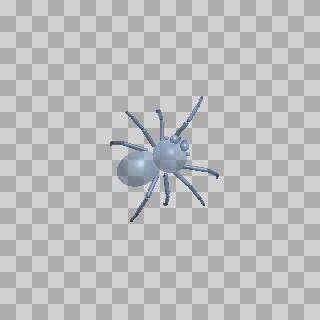
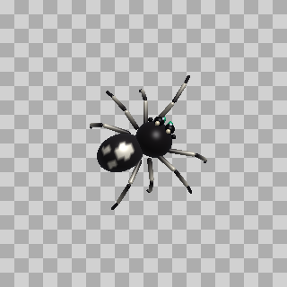
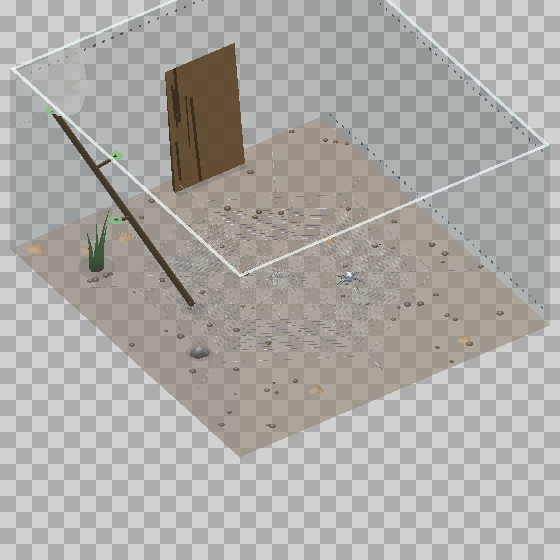
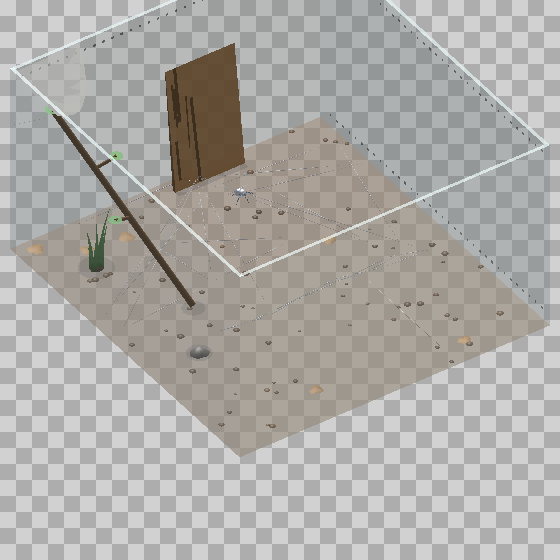
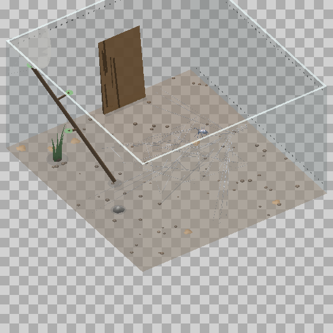

<p align="center">
  
</p>

<h1 align="center">DesktopFly 🪰</h1>

<p align="center">
A 3D fruit fly that lives on your macOS desktop — driven by a live spiking
simulation of the real <a href="https://codex.flywire.ai">FlyWire</a>
connectome. It walks across your windows, grooms, sleeps, and decides to flee
your cursor with the same neurons a real fly uses.
</p>

<p align="center">
  
</p>

<p align="center"><sub>
The fly's brain window: 23,210 real neuron soma positions from FlyWire v783,
with live spikes flashing at real neuron locations. The two glowing yellow
markers are the Giant Fibers — the escape command neurons. Click any region
to stimulate it.
</sub></p>

## What's real

- **23,210 neuron soma positions** (of 139,255 in FlyWire v783) render the
  rotating brain window, colored by super-class (FlyWire's coarse cell-type
  grouping).
- **A 668-neuron circuit with ~19,000 real synaptic connections** (synapse
  counts, signed by neurotransmitter prediction) runs as a 1 kHz
  leaky-integrate-and-fire (LIF) simulation:
  - **LC4 (104) + LPLC2 (210)** looming-detector visual neurons
  - **DNp01 / Giant Fiber (GF) (2)** — the escape command neuron
  - **DNa01 + DNa02 (4)** steering neurons · **DNp09 (2)** forward walking
  - **DNg11 (6)** grooming · **MDN (4)** backward walking ("moonwalker")
  - **DNp02/DNp04/DNp11 (6)** escape-maneuver (wing) neurons
  - their 330 strongest partners, including ascending (proprioceptive) and
    sensory (wind) neurons
- **Escape is not scripted.** Your cursor's approach becomes looming input to
  the real LC4/LPLC2 cells; the fly takes off only when the Giant Fiber
  actually spikes through its real synapses — ~1,200 synapses of feedforward
  inhibition push back, which is why slow approaches are tolerated and fast
  lunges trigger escape in ~4 ms, just like the real animal.

The body itself is procedural (FlyWire is a brain connectome — no body
geometry exists), with a tripod gait, visible wing-beat, altitude-scaled
flight, grooming, and sleep postures.

## Installation

Requirements: **macOS 13+**, Xcode Command Line Tools (Swift 5.9+).
No permissions or entitlements needed — everything it senses
(cursor, window frames, clicks-as-taps, thermal state) is permission-free.

```sh
git clone https://github.com/DenisSergeevitch/desktop-fly.git
cd desktop-fly
./build.sh
./DesktopFly
```

A 🪰 item appears in the menu bar; quit from there. The fly wanders your
desktop on a transparent, click-through overlay — it never intercepts your
mouse or keyboard.

## Controls (menu bar 🪰)

| item | effect |
|---|---|
| Pause / Resume | freeze the world |
| Show/Hide Brain | toggle the live brain window |
| Escape Test (loom) | inject a looming stimulus, watch the GF fire |
| Move to Next Display | hop the fly across monitors (shown when >1 display) |
| Add / Remove Fly | extra flies (only fly #1 carries the brain) |
| Scare Flies | startle everyone |

**The brain window is interactive**: hovering pauses the rotation; clicking a
region "optogenetically" stimulates the ~60 nearest circuit neurons for
400 ms. The fly's reaction is whatever the real network does downstream —
click the Giant Fiber and it escapes; click DNg11 and it grooms; click one
side's DNa01/02 and it turns.

## How real neurons drive the body

| body behavior | driven by |
|---|---|
| escape takeoff | DNp01 giant fiber spike |
| walk vs. rest, walking speed | DNp09 rate |
| steering | DNa01+DNa02 left−right rate difference |
| grooming | DNg11 rate |
| backward scoot | MDN burst |
| nervous darting | LC4/LPLC2 population rate |
| wing-beat effort, threat wing-raise | DNp02/04/11 rate |
| spontaneous takeoff | whole-population arousal |

The loop also closes body→brain: the gait rhythm feeds the circuit's real
ascending (proprioceptive) neurons in phase with the legs, and fast cursor
motion stimulates its sensory (wind) partners.

## Desktop ecology (all permission-free macOS senses)

- **Window terrain**: window top edges are ledges — the fly lands on them,
  walks along them, rides a window you drag, and startles when one closes
  under its feet.
- **Window looms**: a window appearing near the fly feeds the looming
  pathway; the circuit decides whether to flee your dialogs.
- **Clicks are substrate taps**; clicking next to the fly startles it through
  the wind→GF pathway. **Typing is vibration** (idle-time API — knows *when*
  keys were pressed, never which).
- **Circadian rhythm**: dawn/dusk activity peaks, midday siesta, night
  quiescence. **Sleep**: idle at night → it sleeps, breathing slowly, with
  raised arousal threshold; it grooms after waking.
- **Temperature**: flies are ectotherms — a hot Mac is a faster fly.

## Regenerating the data

`data/` ships with compact derived files. To rebuild them from the raw
FlyWire Codex dumps (~60 MB download):

```sh
mkdir -p /tmp/flywire && cd /tmp/flywire
B=https://storage.googleapis.com/flywire-data/codex/data/fafb/783
curl -O "$B/classification.csv.gz" -O "$B/coordinates.csv.gz" \
     -O "$B/connections.csv.gz" -O "$B/consolidated_cell_types.csv.gz"
cd - && python3 etl.py /tmp/flywire
```

## Diagnostics

```sh
./DesktopFly --simtest        # circuit invariants: GF silent at rest, 4 ms loom latency, ...
./DesktopFly --behaviortest   # 17 end-to-end checks: stimulate neurons -> body reacts
./DesktopFly --snapshot f.png  # offscreen fly render
./DesktopFly --brainshot b.png # offscreen brain render
```

## Creature #3: a jumping spider that does not exist (Windows build)

<p align="center">
  
  
</p>

The Rust build (`rust/`) can run a third creature, picked from the tray or
with `--creature salticid`: a **jumping spider** built for people who code.
It watches you from a window ledge, turns its head toward your cursor and
stalks it, abseils off ledges on a dragline, jumps away from a lunge, and
pounces on "bugs" — three drifting points that appear when you tell it a
build failed (`desktopfly notify fail`; `notify pass` sends them off).

**No spider connectome exists**, so this animal is a labelled **chimera**:
every circuit inside it is measured FlyWire data, recombined; the animal is
invented. Its 790-neuron circuit is the fly's looming, escape, steering,
walking, grooming and backing-up modules (the wing module dropped) plus
**LC11 (127)**, FlyWire's small-object motion detectors, with their strongest
downstream partners — and exactly **one authored neuron**, the pounce node,
with **127 authored edges** from LC11. The brain window colours it cool and
draws it larger so it can never hide among real neurons; the tray and the
brain window call it a chimera, never a spider brain. See
[`SPIDER_PLAN.md`](SPIDER_PLAN.md) and
[`data/salticid/PROVENANCE.md`](data/salticid/PROVENANCE.md).

| spider behavior | driven by | status |
|---|---|---|
| escape jump (dragline first) | DNp01 giant fiber spike | measured wiring |
| stalking, walking speed, steering, grooming, backing away | DNp09 / DNa01+02 / DNg11 / MDN, as the fly | measured wiring |
| prey detection | LC11 population rate | measured wiring; size tuning modelled in the transduction |
| head orientation toward prey | LC11 left−right rate | **modelled readout** (LC11 does not reach the steering DNs in the extract) |
| the pounce | the authored pounce node | **authored** |
| settling while you work, bugs on a failed build | foreground app *class*, `notify` hook | senses; content-blind |

Its own suites: `dfcore --creature salticid --simtest` (14 circuit checks:
the giant fiber still fires 4 ms after an abrupt loom; LC11 ignores looms;
the pounce node is silent at rest and under looms, fires only under
small-object drive, and never fires the giant fiber) and `--behaviortest`
(15 end-to-end checks, including bug → LC11 → pounce → capture, and the
silk retreat it spins in a corner and sleeps in).

## Creatures #5–#7: three spiders that build webs (Windows build)

<p align="center">
  
  
  
</p>

Three more species, `--creature araneus | parasteatoda | agelenopsis`, each
building the web its family builds, **as the path it walks**: the spider
goes to an anchor, pays out a line, walks, fixes it, and the thread it just
laid is the web. The sequences are the ethology literature's, at a
compressed tempo (an orb takes the animal about an hour; here about five
minutes of walking):

| species | web | the program (WEB_PLAN.md §5) | catches by |
|---|---|---|---|
| *Araneus diadematus*, garden cross spider | orb, rebuilt daily | exploration → bridge → proto-hub → frame → radii into the largest gap → auxiliary spiral out → sticky capture spiral in, cutting the scaffold as it goes (Zschokke & Vollrath 1995; Zschokke 1996) | struggle on a radius → a run down that radius; a drop on the dragline when threatened |
| *Parasteatoda tepidariorum*, house spider | gumfoot tangle, standing | retreat → tangle in bouts with returns home → sheet, alternating → tensioned lines to the floor with a sticky foot (Benjamin & Zschokke 2003); grows nightly | a bug on the floor touches a foot, the line snaps up with it |
| *Agelenopsis*, grass spider | sheet with a funnel, standing | funnel → alternating support threads and sheet filling over sessions (Rojas 2011) — the sheet thickens rather than being rebuilt | a shake anywhere on the sheet → the fastest rush in the app; a threat means into the funnel, never a drop |

**They share one labelled chimera circuit**, `data/weaver/` (663 neurons,
17,922 measured edges): the fly's looming, escape, steering, walking,
grooming and backing-up modules and its 16 mechanosensory partners, with
**no LC11** — these animals hunt by vibration, not by sight — and exactly
**one authored neuron with no synapses**: the strike node, a vibration
*sense* the fly extract has no counterpart for, driven by the modelled
transduction on a slow membrane with its own threshold. A knock on the web
(a cursor lunge, a click) never touches it; it goes through the measured
wind pathway to the giant fiber, and the spider drops. The **construction
program has no neurons in it at all**, and the tray and brain window say so:
*"…authored strike node; orb web construction program: PROCEDURAL, no
neurons"*. See [`WEB_PLAN.md`](WEB_PLAN.md) and
[`data/weaver/PROVENANCE.md`](data/weaver/PROVENANCE.md).

Webs start inside a vivarium (the tray's *Habitat*; on by default for these
three). House-spider retreats favor upper corners; funnel sheets sit lower.
Walls and solid furniture footprints supply attachment points, and moving
or removing a support breaks its attached strands. On the desktop, sites
prefer gaps between windows but can also use visible application frames,
including maximized windows. Moving, resizing, closing, or covering a frame
disrupts its attachments; construction replans against the changed supports.
A fast cursor sweep through silk cuts it too. Windows UI Automation samples
visible control, link, text-block, and image outlines in the front application;
scrolling, layout changes, and disappearing elements disrupt their attachments.
Only geometry and stable runtime IDs are read, without text or field values.
Apps that do not expose accessibility geometry fall back to window frames.
Sampling runs on a bounded background worker and stale results expire.

Silk now has three-dimensional positions and a damped, tension-only constraint
solver: anchors stay pinned, junctions sag, and unsupported silk falls. Orb webs
stand upright, house-spider tangles occupy depth beneath the lid, and funnel
sheets spread low over the substrate. The animal and caught prey follow the
physical silk. Construction and prey detection still use a 2D chart; this is an
authored biological approximation, not a calibrated material simulation.

Their suites: `dfcore --creature araneus --simtest` (the strike node is
silent for 12 s of rest across seeds, fires within 1 s of a sustained
struggle, has zero synapses so nothing reaches the giant fiber from it; a
tap and an abrupt loom still fire the giant fiber within ~10 ms) and
`--behaviortest` (10 checks for the orb weaver, 8 for the others: a full orb
in under ten minutes of body time with the radius count in the species
band, vibration → strike → capture, repair of a cut radius and a rebuild
after half the web is gone, construction pausing when the walk drive is
down, and the program never exciting the silk).

## Creatures #8–#9: a hognose snake and a sandworm (Windows build)

For a thumper, select **Habitat interactions...** in the tray, choose
**Place a thumper**, and click the top-down map. In the sandworm terrarium,
a Fremen scout also leaves a rocky cave automatically, plants a thumper,
mounts the arriving worm for a short ride, and returns home before the next
expedition. Placing a thumper yourself or stopping it sends the scout home.
The scout kneels to plant, routes around furnishings, climbs aboard, holds
maker hooks while riding, and dismounts smoothly. The thumper has a moving
piston and sand pulses. Habitat status shows the scout's current activity.
For animation snapshots, add `--snapshot-seconds 25 --snapshot scene.png`.
Launch with `./fly.bat --creature sandworm --habitat --literal`.

`--creature hognose | sandworm`, or the tray. Both are **procedural**, on the
koi's terms: no reptile has a connectome at any scale, and the sandworm is
Frank Herbert's, so there is nothing to measure and never will be. Neither
opens a brain window; the tray says `PROCEDURAL - no connectome`, and the
sandworm's name says `fictional` too.

The hognose does what the genus is known for: threatened, it spreads a hood
and mock-strikes with its mouth shut; pressed again, it flips onto its back,
gapes, and plays dead — committed, until you have left it alone for a while.
It burrows at night. The sandworm lives under the sand as a moving ripple,
and comes to a **thumper**: click at a steady beat and it homes on the spot
and breaches there, rearing and opening its three-lobed mouth. Random clicks
and double-clicks are not a rhythm. It is afraid of nothing.

Both live in a sand terrarium in habitat mode, with a cork hide the snake
retreats under. See [DESERT_PLAN.md](DESERT_PLAN.md).

## What's modeled vs. measured

Honesty section: the connectome gives wiring, not physiology. The LIF
dynamics, neurotransmitter signs (ACh+, GABA−, Glu−), the gap-junction boost
on LC→GF and wind→GF (documented electrical coupling), synaptic delays, and
the sensory transduction (cursor → looming value) are standard modeling
choices layered on the real graph. Everything downstream of the sensory
neurons — who connects to whom, and how strongly — is FlyWire data.

The Rust build adds, all labelled as such in code and UI: **habituation**
(a modelled learning rule; the phenomenon is real, the connectome does not
carry it); and for the chimera, the **small-object size tuning** presented to
LC11 (the lobula is outside the extract), the **head-orientation readout**
of LC11's left−right rate, and the **authored pounce node** — 1 neuron and
127 edges out of 790 neurons and 26,237 edges, counted by the data, not by
a constant. For the web builders: the **strike node** — 1 authored neuron
with 0 edges out of 663 neurons and 17,922 edges, with its own 1 s membrane
and threshold; the **vibration transduction** (silk excitation under the
legs and across the web → that node's input); the **prey localisation
readout** (the loudest node of the silk is where the spider goes); and the
**web construction programs**, which are procedural motor programs with no
neurons in them, labelled PROCEDURAL wherever the creature is named.

## License & citation

Code is MIT. The files in `data/` are derived from FlyWire (FAFB v783) and
are **CC BY-NC 4.0** — see [data/DATA_LICENSE.md](data/DATA_LICENSE.md).
If you use this, cite:

- Dorkenwald, S. et al. *Neuronal wiring diagram of an adult brain.* Nature 634, 124–138 (2024). https://doi.org/10.1038/s41586-024-07558-y
- Schlegel, P. et al. *Whole-brain annotation and multi-connectome cell typing of Drosophila.* Nature 634, 139–152 (2024). https://doi.org/10.1038/s41586-024-07686-5


### Habitat interactions and glass aquarium

Open **Habitat interactions...** in the Windows tray menu to offer food/prey,
move furnishings with a top-down placement map, adjust hognose heat sources,
place/stop a sandworm thumper, or toggle quiet observation. The koi enclosure
now has transparent sides and a visible water column. Feeding depends on
appetite, safety and reaching the surface. Ordinary overlay clicks remain
click-through. See [the behavior audit and controls](HABITAT_INTERACTIONS.md)
for species-specific behavior, evidence, and scientific limitations.


### Inspecting animal detail

In habitat mode, use the tray **View > Close-up (follow the animal)**. The camera
fits the animal rather than the surrounding web or habitat. For the hognose,
**View > Head close-up** uses a lower angle and frames its head and neck.

Diagnostic example (release build):

```powershell
./rust/target/release/desktopfly.exe --creature hognose --literal --habitat --head-closeup --alt -1 --size 1200 --snapshot hognose-head.png
```

The detailed hognose uses the editable Blender source in `art/blender`; the
other animals use refined procedural meshes. See `VISUAL_FIDELITY.md` for scope.

### Animal size and shelter visibility (Windows)

In the tray menu, **Animal size (habitat off)** offers 50%, 100%, 150%,
200%, 300%, and 400%. It scales the free-roaming animal and its glass anatomy;
habitat view size remains separate. The setting is remembered across restarts.

For the hognose's terrarium, use **Contents > See-through hides** to make the
cork shelters faintly transparent while the snake still uses them as shelter.
Toggle it off to restore their normal appearance. This preference is also saved.

Offscreen diagnostics accept `--animal-scale 2` (without `--habitat`) and
`--habitat --see-through-hides`.
